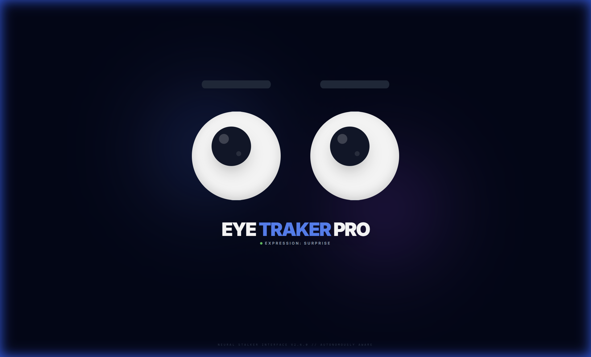

# EYE TRAKER PRO

An interactive, autonomously aware eye-tracking application built with Next.js, React, and Tailwind CSS. The eyes follow your mouse cursor and exhibit various emotional expressions based on movement speed and random intervals.



## Features

- **Dynamic Mouse Tracking**: Eyes follow the mouse cursor with smooth, reactive movement.
- **Emotional Expressions**: Over 10+ expressions including *neutral*, *surprise*, *heart-eyes*, *angry*, *stoned*, and more.
- **Reactive Surprise**: Sudden, fast mouse movements trigger the *surprise* expression.
- **Autonomous Behavior**: Random expression changes occur over time for a "living" experience.
- **Modern Aesthetics**: Sleek, dark-themed UI with glassmorphism effects and smooth transitions.
- **Performance Optimized**: Efficient animation logic using React hooks and CSS transitions.

## Tech Stack

- **Framework**: [Next.js](https://nextjs.org/)
- **Library**: [React](https://reactjs.org/)
- **Styling**: [Tailwind CSS](https://tailwindcss.com/)
- **Icons**: SVG-based pupils (including heart-eyes)

## Getting Started

### Prerequisites

- Node.js installed on your machine.
- npm or yarn package manager.

### Installation

1. Clone the repository or open the project folder.
2. Install dependencies:
   ```bash
   npm install
   ```

### Running the App

1. Start the development server:
   ```bash
   npm run dev
   ```
2. Open your browser to [http://localhost:3000](http://localhost:3000) (or the port specified in your terminal).

## Interface

The interface features a "Neural Stalker Interface" aesthetic, providing a futuristic and slightly eerie user experience.

---
*Created with focus on visual excellence and interactive dynamics.*
